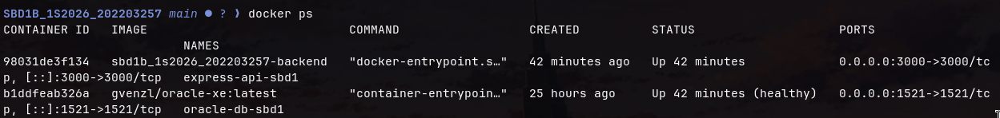
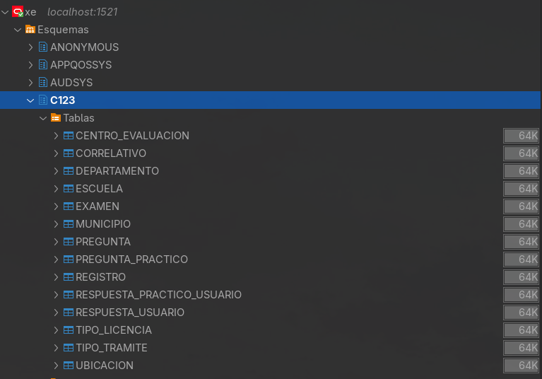
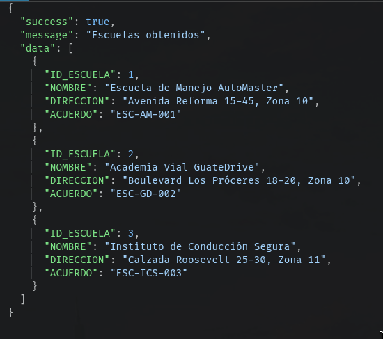
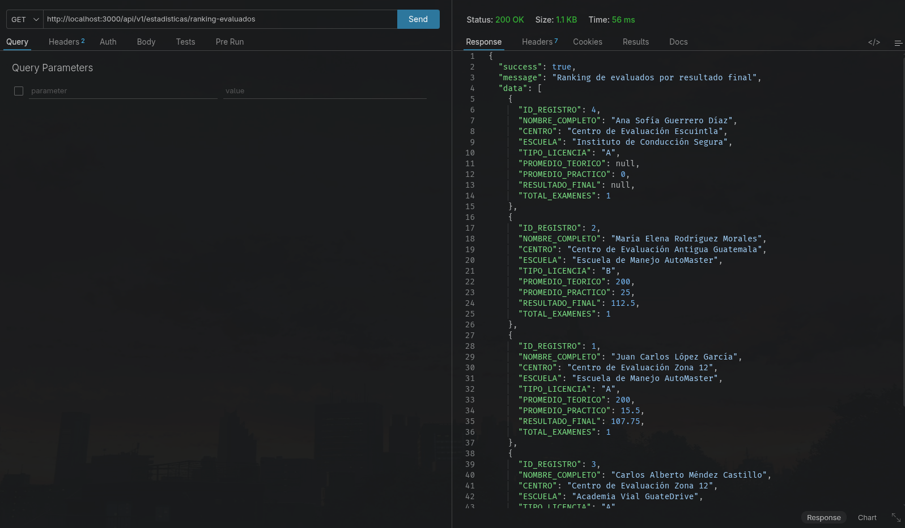
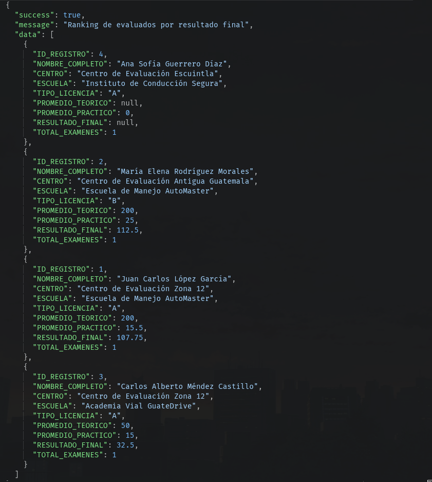
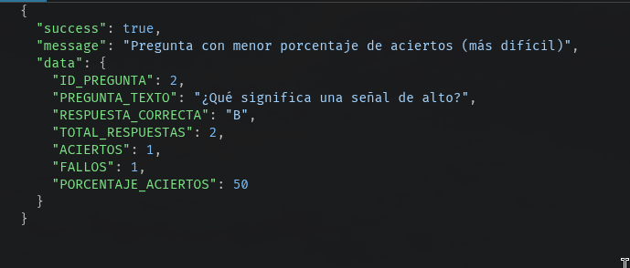

# BD1B_1S2026_202203257 - Centros de Evaluación de Manejo

## Descripción

Backend con API REST para la gestión de Centros de Evaluación de Manejo en Guatemala. El proyecto dockeriza Oracle XE y expone servicios CRUD y consultas estadísticas sobre aspirantes, evaluaciones y resultados.

**Stack:**

- Docker & Docker Compose
- Oracle Database XE (gvenzl/oracle-xe)
- Node.js + Express
- DBeaver (administración)
- Postman (pruebas)

---

## Despliegue con Docker

### Requisitos previos

- Docker y Docker Compose instalados
- Node.js 18+ (solo si deseas ejecutar fuera de Docker)

### Pasos

1. **Clonar el repositorio**

```bash
git clone https://github.com/akaluizss/SBD1B_1S2026_202203257.git
cd SBD1B_1S2026_202203257
```

2. **Levantar los servicios**

```bash
docker-compose up --build
```

3. **Esperar a que Oracle esté listo** (~3-5 min primera vez)

```bash
docker-compose logs -f database
```

Buscar el mensaje: *"Oracle Database is ready to use"*

4. **Verificar servicios**

```bash
docker-compose ps
```

La API estará en `http://localhost:3000` y Oracle en `localhost:1521`.

---

## Conexión desde DBeaver

1. Abrir DBeaver → **Database → New Database Connection → Oracle**
2. Usar los siguientes datos:

| Campo | Valor |
| --- | --- |
| Host | localhost |
| Port | 1521 |
| Database (SID) | xe |
| Username | C123 |
| Password | 12345 |

3. Clic en **Test Connection** → debe mostrar "Connected successfully"
4. Al conectar, las tablas estarán bajo el esquema **C123**

> **Credenciales alternativas (SYS):** Username: `sys`, Password: `system123`, Role: `SYSDBA`

---

## API Endpoints

Base URL: `http://localhost:3000/api/v1`

### CRUD (15 tablas, 75 endpoints)

Cada entidad tiene: `GET /`, `GET /:id`, `POST /`, `PUT /:id`, `DELETE /:id`

| Entidad | Ruta |
| --- | --- |
| Departamentos | `/departamentos` |
| Municipios | `/municipios` |
| Centros de Evaluación | `/centros-evaluacion` |
| Escuelas | `/escuelas` |
| Ubicaciones | `/ubicaciones` |
| Tipos de Licencia | `/tipos-licencia` |
| Tipos de Trámite | `/tipos-tramite` |
| Registros | `/registros` |
| Correlativos | `/correlativos` |
| Exámenes | `/examenes` |
| Preguntas | `/preguntas` |
| Preguntas Prácticas | `/preguntas-practicas` |
| Respuestas Usuario | `/respuestas-usuario` |
| Respuestas Práctico Usuario | `/respuestas-practico-usuario` |

### Consultas Estadísticas

| Consulta | Método | Ruta |
| --- | --- | --- |
| Promedios por centro y escuela | GET | `/estadisticas/promedios` |
| Ranking de evaluados | GET | `/estadisticas/ranking-evaluados` |
| Pregunta más difícil | GET | `/estadisticas/dificultad-preguntas` |

---

## Evidencia de Funcionamiento

### 1. Docker - Servicios corriendo



### 2. DBeaver - Conexión exitosa y tablas visibles



### 3. Postman - Ejemplo de respuesta exitosa



### 4. Postman - Ejemplo de respuesta JSON



### 5. Postman - Consulta Estadística: Promedios

> [Aquí va captura de GET a `/estadisticas/promedios` con datos de total_examenes, promedios y aprobados]

### 6. Postman - Consulta Estadística: Ranking



### 7. Postman - Consulta Estadística: Pregunta más difícil



---

## Variables de Entorno

Ver `.env.example` para todas las variables configurables.

---

## Autor

202203257 - SBD1 - 1S2026
